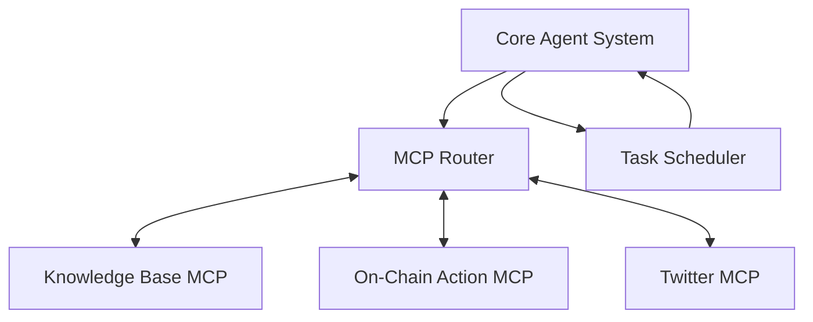
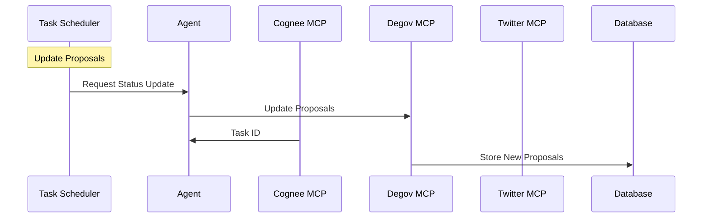
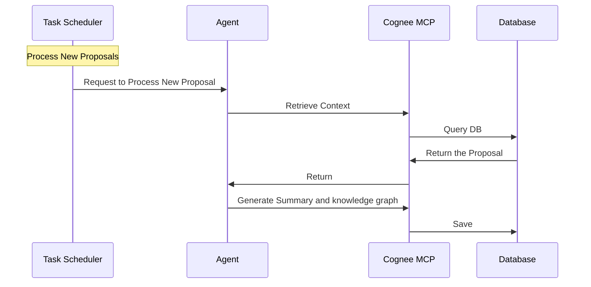
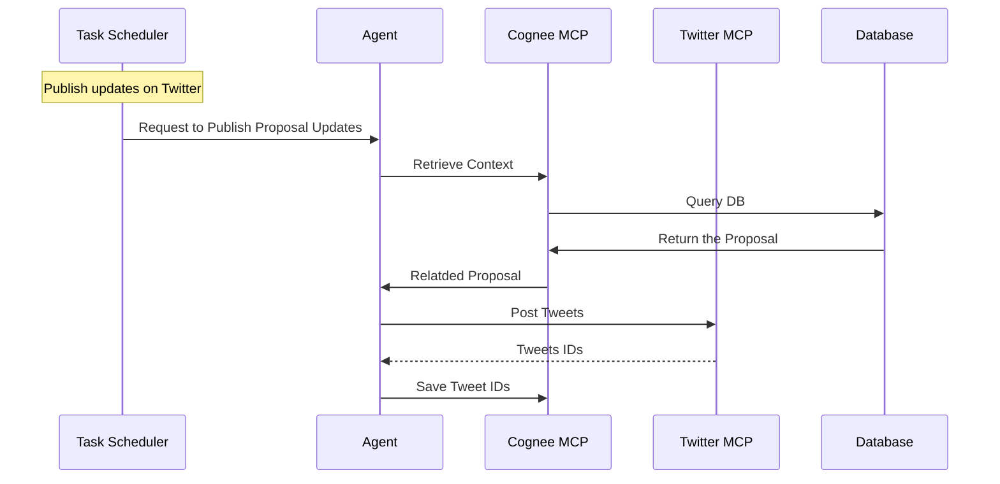
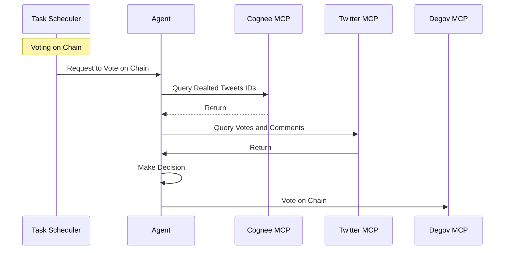
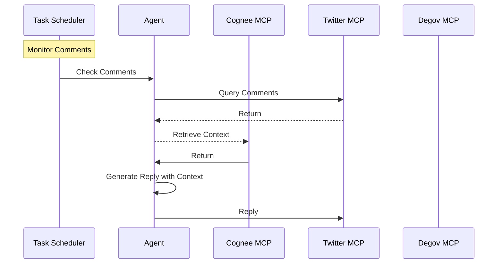

# Degov Phase 3: AI Agent Capabilities

## Description

This project aims to develop an advanced DAO agent system that enhances governance participation through automated proposal monitoring, intelligent voting strategies. The system will leverage AI and blockchain technology to create a more efficient and inclusive DAO governance process.

## Grant Basic Information

### Team

- [Nada](https://github.com/casinoyoda)
- [Bear Wang](https://github.com/boundless-forest) from Itering
- [Yuqi Lau](https://github.com/DreUncle) from Itering
- [Denny Wang](https://github.com/hackfisher) from Itering

### Code Repositories

- https://github.com/casinoyoda/degovagent

### Time Estimation and Cost

- Estimated Duration: 6 weeks
- Cost: 3000 USD

## Proposal Details

### Technology Stack

- Programming language: Python 3.12+, TypeScript
- LLM: Claude model & MCP
- Knowledge: [Cognee](https://github.com/topoteretes/cognee)
- Database: PostgreSQL
- MCP servers:
  - For X interaction: https://github.com/adhikasp/mcp-twikit
  - For Agent memory: https://github.com/topoteretes/cognee/tree/main/cognee-mcp
  <!-- - For blockchain interaction: todo! -->
  - For degov interaction: we need to build a new MCP server for proposal related operations, such as   monitoring, voting, creating proposals, etc.

### System Architecture

<!-- TODO: Need to add some text explanation for the system architecture diagram, I know that you have added some diagrams below and Component Description, but better to have text explanation for the overall system design and tasks kinds.-->

<!-- TODO: Maybe miss the solution explanation for the `Setup AI Agentic Delegate on DeGov.AI Platfrom` in the rfps https://github.com/ringecosystem/collaboration/blob/master/rfps/dao-ai-agent.md -->

#### Component Description

<!-- I recommend to put the component description into the explanation of the system architecture diagram. Combined with the diagram to illustrate what each component does and the relationship between them. -->

1. **Core Agent System**
   - Manages LLM interactions via Claude API
   - Communicates with MCP Server to trigger external actions
   - Receives and processes task requests from the Task Scheduler
   - Maintains and updates memory for proposal-related tasks

2. **Task Scheduler**
   - Periodically triggers the agent to perform specific tasks
   - Tasks include:
     - Scraping new proposals
     - Publishing proposal updates on Twitter
     - Responding to Twitter comments
     - Collecting community opinions on proposals and executing votes accordingly

<!-- I'm curious about which component is responsible for the proposal monitoring? -->

3. **Cognee MCP**
   - Maintains agent memory
   - Provides relevant context for agents

4. **Degov MCP**
   - Maintains proposals in the DB
   - Supports voting on-chain
   - Scrapes proposals

#### Tasks and Workflows

<!-- I recommend to sort all the tasks workflow in this section with comprehensive text explanation for each workflow. -->

<!--  I think you also need to have a basic understanding of the lifecycle of the openzeppelin's proposal, then you can design the system architecture better. For example, the proposal events, such as created and voted is important for the proposal monitoring. they can be used to trigger the agent to perform specific tasks. You need to design the task scheduler based on the proposal events.  -->

1. Proposal Status Update Workflow

TODO: Need to add some explanation for the diagram. 

2. Handling New Proposal Workflow

<!-- TODO: Need to add some explanation for the diagram. -->

3. Publish Proposal Updates on Twitter

<!-- TODO: Need to add some explanation for the diagram. -->

4. On-Chain Voting Workflow

<!-- TODO: Need to add some explanation for the diagram. -->

5. Twitter Comments Interaction Workflow

<!-- TODO: Need to add some explanation for the diagram. -->

### Deliveries

- DeGov MCP, a new MCP server for proposal related operations, such as monitoring, voting, creating proposals, etc.
- The task scheduler, which is responsible for scheduling tasks and triggering the agent to perform specific tasks.
- The core agent system, which is used to accept the task requests from the task scheduler and perform the corresponding tasks via interacting with the support MCP servers.
- Proposal monitoring, I'm not sure which component is responsible for this.
- Agent Delegate, I'm not sure how this will be implemented. maybe we should discussion this further based on https://github.com/ringecosystem/degov/issues/121
- Comprehensive Documentation
    - Details design documents for the system architecture and components
    - API docs for the new developed MCP server
    - Agent Delegate Deployment guide

<!-- I recommend to write the deliverables like something above, make the thing as detailed and clear as possible. -->

