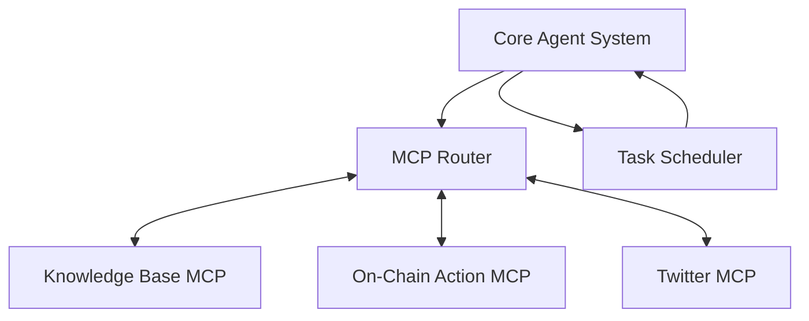
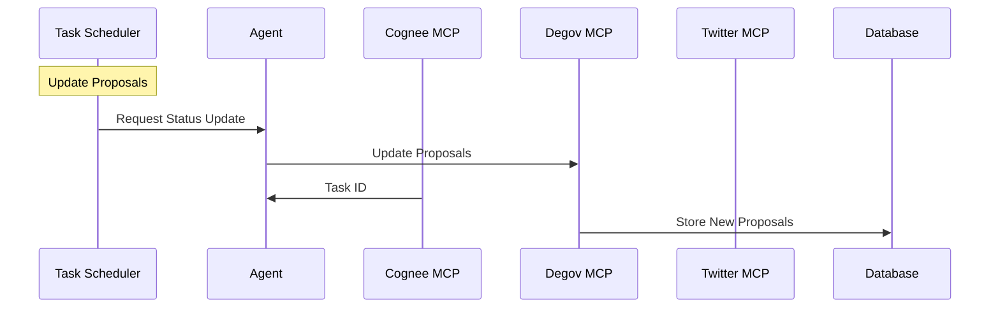
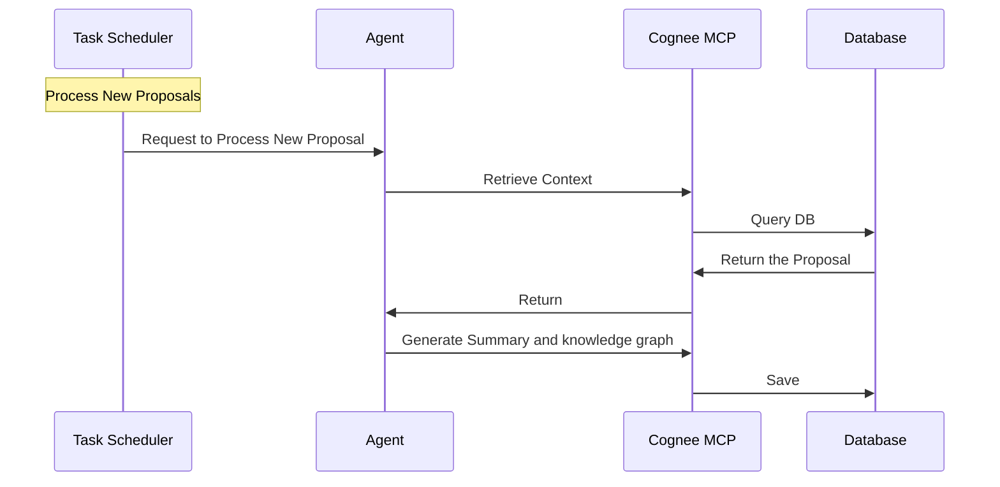
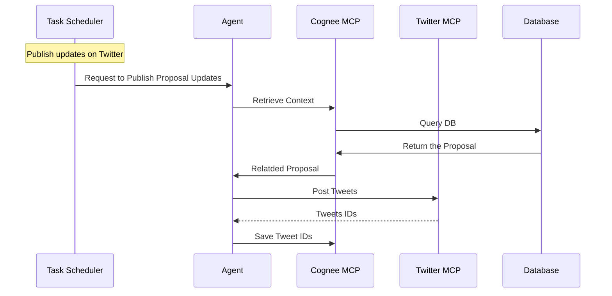
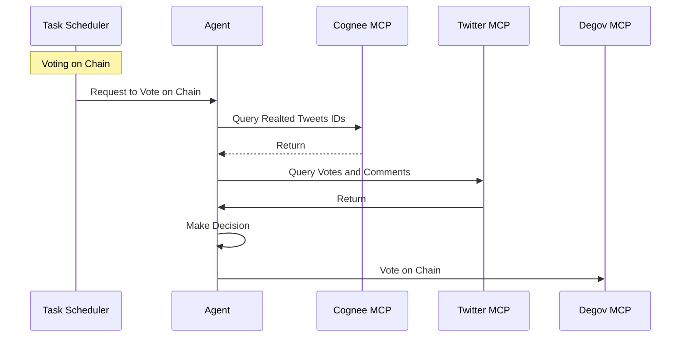
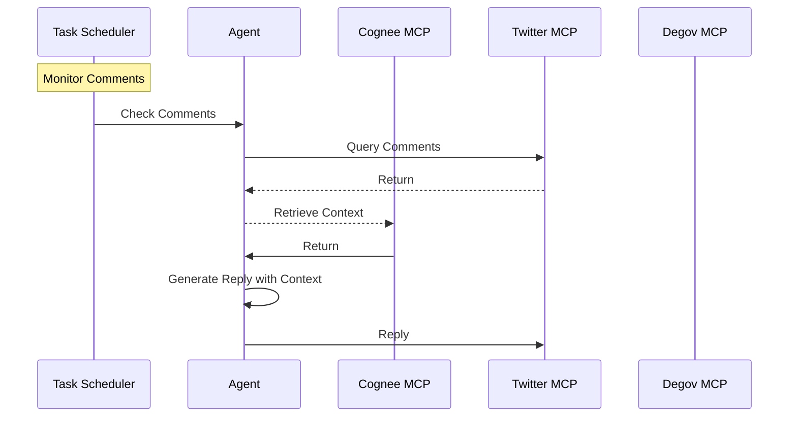

# Degov Phase 3: Advanced DAO Agent System

## Description
This project aims to develop an advanced DAO agent system that enhances governance participation through automated proposal monitoring, intelligent voting strategies. The system will leverage AI and blockchain technology to create a more efficient and inclusive DAO governance process.

## Team
- [Nada](https://github.com/casinoyoda)
- [Bear Wang](https://github.com/boundless-forest) from Itering
- [Echo](https://github.com/hujw77) from Itering
- [Yalin Cai](https://github.com/fewensa) from Itering
- [Yuqi Lau](https://github.com/DreUncle) from Itering

### Code Repositories
- https://github.com/casinoyoda/degovagent

## Grant Information
- Estimatd Duration: 6 weeks
- Cost: 3000 USD

## Proposal Details

### Deliveries
1. Open Source Code Repository
   - Complete source code for the DAO agent system
   - Build and deployment scripts
   - Integration tests

2. Comprehensive Documentation
   - Detailed system architecture documentation
   - Step-by-step installation guide
   - API documentation and usage examples
   - Deployment guide

## Technology Stack

- **Programming Language**: Python 3.12+
- **LLM**: Claude & MCP
- **Knowledge**: [Cognee](https://github.com/topoteretes/cognee)
- **Database**: PostgreSQL
- **MCP servers**:
  - [Twitter](https://github.com/adhikasp/mcp-twikit)
  - [Cognee](https://github.com/topoteretes/cognee/tree/main/cognee-mcp): Agent memory
  - Degov MCP: Proposal scraping, voting on chain

## System Architecture

### High-Level Components

### Component Description

1. **Core Agent System**
   - Manages LLM interactions via Claude API
   - Communicates with MCP Server to trigger external actions
   - Receives and processes task requests from the Task Scheduler
   - Maintains and updates memory for proposal-related tasks

2. **Task Scheduler**
   - Periodically triggers the agent to perform specific tasks
   - Tasks include:
     - Scraping new proposals
     - Publishing proposal updates on Twitter
     - Responding to Twitter comments
     - Collecting community opinions on proposals and executing votes accordingly

3. **Cognee MCP**
   - Maintains agent memory
   - Provides relevant context for agents

4. **Degov MCP**
   - Maintains proposals in the DB
   - Supports voting on-chain
   - Scrapes proposals

## Workflow Designs

### 1. Proposal Status Update Workflow

### 2. Handling New Proposal Workflow

### 3. Publish Proposal Updates on Twitter

### 4. On-Chain Voting Workflow

### 5. Twitter Comments Interaction Workflow

